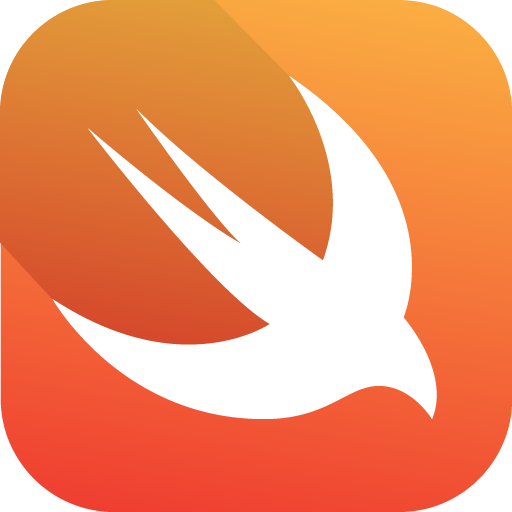

<h2>Hi I'm Daniel Vieira "dnnL" </h2>

### Contact and networks

  Contact me

  
   
  

---

  💻 <b>Web developer - Focused on Angular and Spring-boot technologies </b> &nbsp;

  💻 <b>Mobile developer - Focused on Learning Swift iOS technology </b> &nbsp;

  📌 Living in <b>São Paulo, Itapecerica da Serra</b>, <b>Brazil</b> &nbsp;

  📚 Graduated as a <b>Bachelor of Information Systems</b> &nbsp;

  🌱 I am currently studying: **Swift**

---

## Some knowledge in technologies

---

 <b> In my free time I like to play on Computer with some friends (🎮), Watch movies (🎞️) , Series (📺), Animes (🎞️) and listen to music (🎵).</b>

---

